# 🤝 Agent Teams

**把一个复杂问题，交给一支自动组建的 AI 专家团队**

Leader 智能编排 · DAG 并行执行 · SSE 实时流式 · 107 位领域专家 · 知识图谱 GraphRAG

[](./LICENSE)
[](#-为什么做-agent-teams)
[](#-快速开始docker)
[](#-快速开始docker)
[](#-快速开始docker)
[](https://nickzhang1102.github.io/agentTeams/)

**简体中文** | [English](./README.en.md)

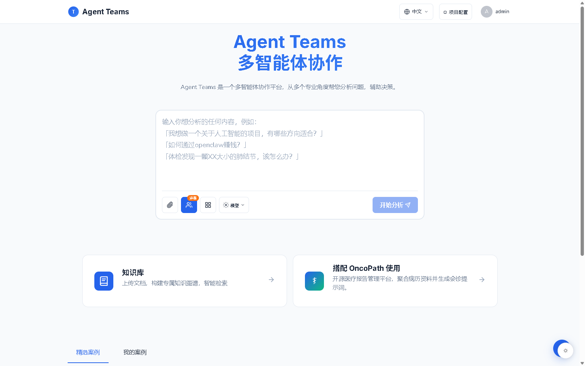

[项目网站](https://nickzhang1102.github.io/agentTeams/) · [快速开始](#-快速开始docker) · [界面预览](#-界面预览) · [参与贡献](#-参与贡献) · [☕ 请作者喝咖啡](#-赞助支持)

> **状态说明**：本项目已公开，处于早期版本阶段，欢迎试用与反馈。公网自托管部署前，请先完成[安全](#-安全)一节中的必改项。

---

## 🎯 为什么做 Agent Teams

大多数 AI 产品给你的是一个聊天窗口，但复杂问题往往需要的是一个**团队**。作为想用 AI 解决实际问题的人，你大概率遇到过这些情况：

| 现实困境 | Agent Teams 的回答 |
|---------|----------------|
| 🤖 单个聊天机器人只有一个视角，复杂问题容易顾此失彼 | 描述问题后由 **Leader 自动组建专家团队**，107 位领域专家从多视角交叉补充 |
| 🔁 挨个咨询多个 AI、来回复制粘贴上下文，费时费力 | Leader 全程编排：需求评估 → 团队组建 → **任务拆解为 DAG 并行执行** → 汇总为一份综合报告 |
| 🧰 专业问题缺少结构化方法论，提示词全靠现编 | 医疗专科、商业角色、金融证券期货等 **107 位内置专家开箱即用**，各带领域思维框架 |
| 🕳️ AI 给出结论就结束，过程是黑盒、证据无从查起 | 子任务拆解与**工具原始返回全程入库**，报告可逐层下钻到原始证据，历史会话完整回看 |
| ☁️ 敏感资料不敢交给第三方在线平台 | **完全自托管**：数据落在你自己的 PostgreSQL，LLM 与搜索凭证在项目内配置并加密存储 |

Agent Teams 面向想要「AI 团队」而非「AI 聊天窗口」的个人与小团队：一条命令完成自部署，桌面与移动端自适应，界面中英双语——AI 负责整理与分析，最终判断永远属于你。

---

## ✨ 核心功能

### 🤖 多智能体编排
| 功能 | 说明 |
|------|------|
| 🧠 **Leader Agent** | 需求评估 → 团队组建 → 任务拆解为 **DAG 执行计划** → 分批并行执行 → 结果汇总，全程无需人工干预 |
| 🔍 **过程透明可追溯** | 子任务分解与每个工具的原始返回全程入库，综合报告可下钻到原始证据 |
| 🔄 **动态子任务** | 执行过程中按需追加子任务，上限守卫防止失控 |
| 🧯 **容错执行** | 单个工具失败不中断整体流程，部分返回数据仍会传入后续推理 |

### 👥 专家矩阵
| 功能 | 说明 |
|------|------|
| 👥 **107 位内置专家** | 医疗专科（内科/外科/专科/医技）、商业角色（CEO·CTO·CFO·产品·UI·交互）、金融期货证券（CIO·CRO·量化·宏观/黑色/有色/农产品分析师……），分类动态聚合、开箱即用 |
| 📦 **AgentPack 组合包** | 将常用专家组合成包，系统预设直接可用，支持克隆改造 |
| 📋 **工作流模板** | 预设团队方案与评估阈值，一键启动，跳过重复配置 |

> 注：部分商业/金融类 Agent 以公开人物命名（如「CEO（贝佐斯思维模型）」），仅为对其公开方法论与思想风格的致敬与借鉴，与本人无任何关联，不代表其观点或背书；医疗类 Agent 均以科室角色命名，其输出定位见[医疗免责声明](#️-医疗免责声明)。

### 💬 对话体验
| 功能 | 说明 |
|------|------|
| ⚡ **SSE 实时流式** | 打字机式实时输出，每个 Agent 的执行状态全程可见 |
| 📄 **富文本与导出** | Markdown + 代码高亮渲染，报告支持 PDF / 图片导出与会话分享 |
| 🌗 **暗色主题 & 双语** | 一键切换深浅色；中文 / English 界面切换；移动端自适应 |
| 💡 **建议问题** | 对话结束后推荐追问方向，越聊越深 |

### 🧠 知识与平台
| 功能 | 说明 |
|------|------|
| 🕸️ **知识图谱** | D3 可视化、GraphRAG 检索、知识缺口（Gap Analysis）分析 |
| 📎 **文档理解** | PDF / DOCX / XLSX / PPTX 解析与 OCR，文件版本管理 |
| 🧩 **MCP 工具生态** | MCP 工具注册与管理，工具调用全量审计日志 |
| 🖥️ **管理后台** | 仪表盘统计、Agent 可视化编辑、性能监控、系统设置集中管理 |

---

## 📸 界面预览

> 以下截图均由当前前端加载固定的虚构演示数据后实拍生成，不含任何真实用户信息。

**综合报告** — 汇总各专家结论生成结构化报告，可下钻到原始证据

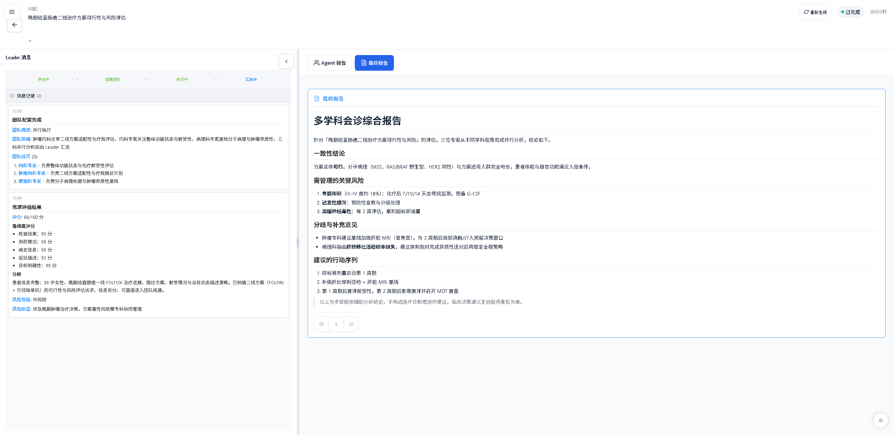

**执行编排视图** — Leader 把任务拆解为阶段与子任务，每个 Agent 的执行状态实时可见

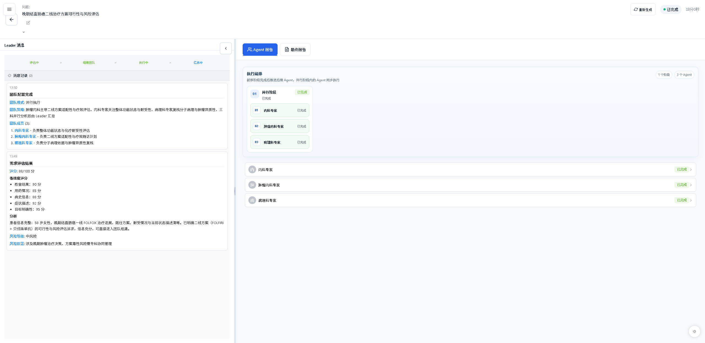

### 📁 更多截图（专家矩阵 / 团队方案 / 管理后台 / 项目配置）

**Agent 广场** — 107 位领域专家按领域分类，开箱即用

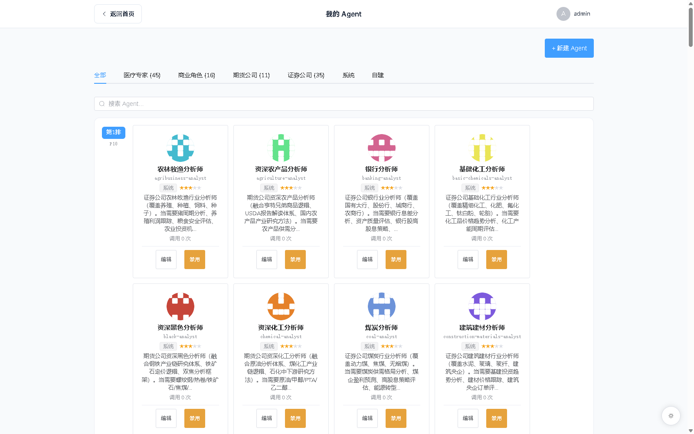

**团队方案** — 系统预设组合包与工作流模板，一键启动

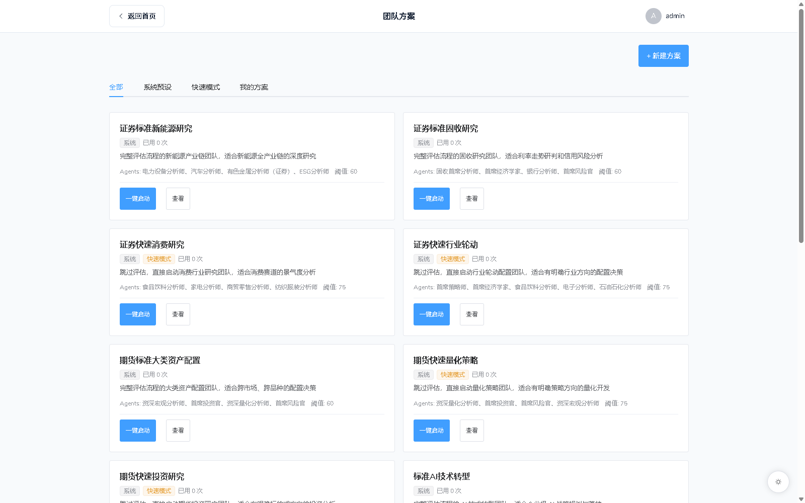

**管理后台** — 仪表盘统计、性能监控与系统设置集中管理

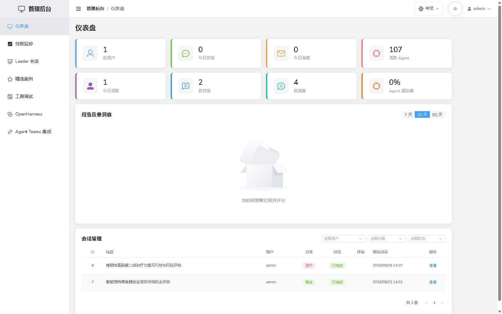

**项目配置** — LLM 与搜索凭证在项目内配置，密钥加密存储

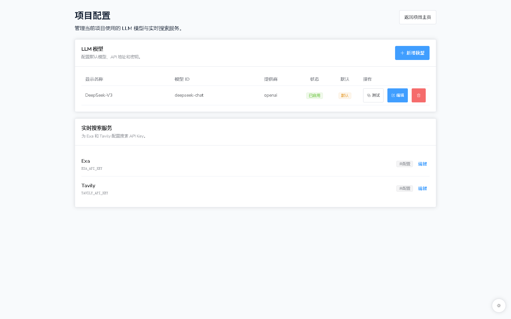

**移动端**

| 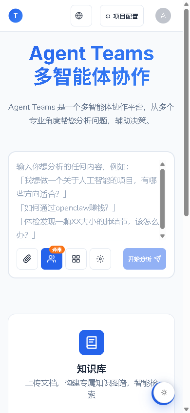 | 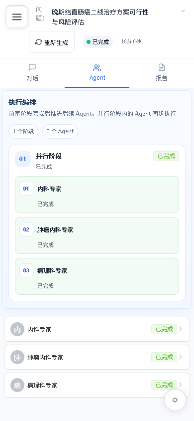 | 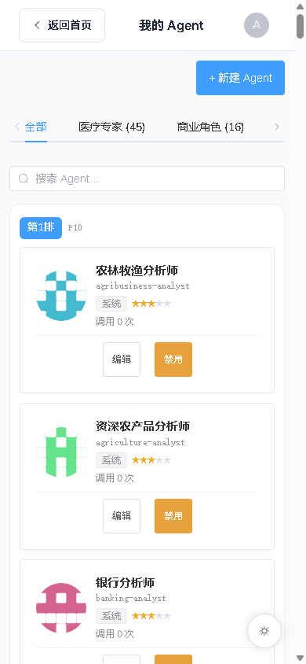 | 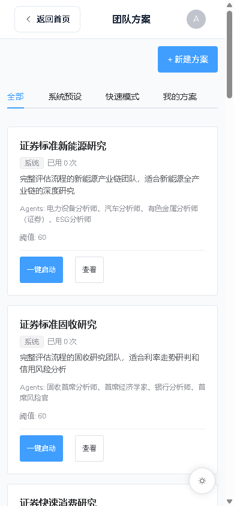 |
|---|---|---|---|

---

## 🚀 快速开始（Docker）

最快的方式是用 Docker Compose 一键拉起完整环境。

### 1️⃣ 克隆与配置

```bash
git clone https://github.com/nickzhang1102/agentTeams.git
cd agentTeams
cp backend/.env.example backend/.env
```

编辑 `backend/.env`，**必须填写**以下 2 项（部署脚本会校验强度）：

| 变量 | 说明 | 生成方式 |
|------|------|----------|
| `SECRET_KEY` | 应用根密钥（≥32 字符），同时用于数据库凭证加密 | `python -c "import secrets; print(secrets.token_hex(32))"` |
| `JWT_SECRET_KEY` | JWT 签名密钥（≥32 字符） | 同上 |

> **LLM 配置无需预填**：部署完成后登录系统，在后台「LLM 模型」添加任意 OpenAI 兼容模型即可；Exa/Tavily 搜索 Key 在后台「系统设置」配置。所有凭证加密存库、保存后生效。

### 2️⃣ 一键部署

```bash
# Linux / macOS
./scripts/docker-deploy.sh

# Windows (PowerShell)
.\scripts\docker-deploy.ps1
```

脚本自动完成镜像构建 → 服务启动 → 数据库迁移（幂等）。前端暴露 `8380` 端口，PostgreSQL 与后端仅绑定宿主机回环地址。详细配置见 [DOCKER.md](./DOCKER.md)。

### 3️⃣ 访问

- 前端：<http://localhost:8380>
- 管理员账号 `admin`。**推荐**：启动前在 `backend/.env` 中设置 `ADMIN_INITIAL_PASSWORD`（至少 8 位、含字母和数字），首次创建 admin 时将直接用它作为初始密码，无需翻查日志；未设置时回退为随机生成——见 `docker compose logs backend`（注意日志会保留历史容器输出，请认准最近一次"管理员已创建"的记录）或宿主机 `backend/data/.admin_initial_password` 文件（仅本地开发 `APP_ENV=development` 时为 admin/admin123）。忘记密码或账户被锁：`docker compose exec -e ADMIN_INITIAL_PASSWORD='新密码' backend python reset_admin.py`。

---

## 💻 本地开发

前置要求：Node.js 20.19+ · Python 3.11+ · PostgreSQL 18 · 一个 OpenAI 兼容的 LLM 服务账号

```bash
# 后端（http://localhost:5000）
cd backend
python -m venv venv && source venv/bin/activate      # Windows: venv\Scripts\activate
pip install -r requirements.txt
pip install -e ../OpenHarness                        # 内嵌执行框架，本地开发必需
cp .env.example .env                                 # 设置 DATABASE_URL / SECRET_KEY / JWT_SECRET_KEY
alembic upgrade head                                 # 初始化数据库
python init_admin.py                                 # 创建管理员（development 下默认 admin/admin123）
python run.py

# 前端（http://localhost:5173，新终端）
cd frontend
npm install
npm run dev
```

完整步骤与常见问题见 [QUICKSTART.md](./QUICKSTART.md)。

---

## 🔒 安全

- **认证与传输**：JWT + httpOnly Cookie（SameSite=Strict）；密码 pbkdf2 哈希存储 + RSA 加密传输
- **密钥治理**：`SECRET_KEY` / `JWT_SECRET_KEY` 启动强制校验，缺失或弱密钥拒绝启动（fail-closed）；数据库凭证使用根密钥加密存储，轮换流程见 `.env.example` 说明
- **上传防护**：上传采用流式分块校验，防止超大文件耗尽内存
- **默认生产姿态**：未显式设置 `APP_ENV=development` 时一律按生产标准启动

公网部署必改项：设置强随机的两个密钥、修改默认管理员密码、由反向代理提供 HTTPS 并仅开放 80/443、定期备份数据库。详见 [DOCKER.md](./DOCKER.md) 与 [SECURITY.md](./SECURITY.md)。

---

## ⚠️ 医疗免责声明

本项目内置的医疗领域 Agent 仅用于**健康信息的整理与辅助理解**，其输出不构成医疗诊断、治疗建议或处方意见，也不属于医疗器械用途。任何诊疗决策必须由具备执业资质的医师作出。详见 [DISCLAIMER.md](./DISCLAIMER.md)。

---

## 📄 许可证

本项目采用 **双许可** 模式：

- **开源使用**：基于 [AGPL-3.0](./LICENSE) 协议开源。通过网络服务（SaaS）方式向他人提供本软件时，同样需要按 AGPL-3.0 开放源码。
- **商业许可**：不希望受 AGPL-3.0 义务约束（如闭源商用、私有化 SaaS 部署）的组织可联系作者获取商业授权。nickzhang1102@163.com
- 内嵌的 [OpenHarness](./OpenHarness/) 框架采用 MIT 协议；接受外部贡献要求签署 CLA 以维持双许可模式，详见 [CONTRIBUTING.md](./CONTRIBUTING.md)。

版权所有 © 2026 nickzhang1102 · GitHub [@nickzhang1102](https://github.com/nickzhang1102)

---

## 🤝 参与贡献

欢迎参与贡献！Fork → 创建特性分支 → 提交（遵循 Conventional Commits：`feat:` / `fix:` / `docs:` 等）→ 发起 Pull Request。完整流程与规范见 [CONTRIBUTING.md](./CONTRIBUTING.md)。

---

## ☕ 赞助支持

如果 Agent Teams 对你有所帮助，欢迎请作者喝一杯咖啡 ☕

**每一份支持都是作者持续维护的动力，真的很重要！**

| 💚 微信 | 💙 支付宝 |
| :---: | :---: |
|  |  |

也欢迎点一个 ⭐ Star，让更多有需要的人看到这个项目。
